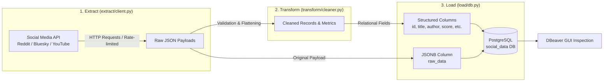

# Social Media ETL Pipeline

A modular, automated **Extract, Transform, Load (ETL)** pipeline built with Python and PostgreSQL. This project extracts nested social media data, transforms and cleans the payloads, and persists them into a PostgreSQL database using a **hybrid data model** (relational columns for structured querying + PostgreSQL `JSONB` for raw API preservation).

---

## Architecture Overview



### Why a Hybrid Data Model?
Social media APIs frequently update their schema, deprecate fields, or introduce nested metadata. By pairing typed relational columns with a `JSONB` raw payload column:
- **Fast Analytics**: Indexed relational columns (`post_id`, `score`, `created_at`) allow instant SQL filtering and sorting.
- **Future-Proofing**: The complete, untouched API payload is preserved in `raw_data (JSONB)`, enabling backfilling new columns without re-fetching past data.

---

## Tech Stack

- **Language**: Python 3.13
- **Database**: PostgreSQL (v16 via Docker or v18 native Windows service)
- **ORM / Driver**: SQLAlchemy 2.0 & `psycopg` (v3)
- **Data Manipulation**: Pandas
- **Resilience**: Tenacity (retries with exponential backoff)
- **Environment Management**: `python-dotenv`
- **Database GUI**: DBeaver

---

## Directory Structure

```plaintext
social-media-etl/
├── .venv/                  # Virtual environment with installed dependencies
├── extract/
│   └── client.py           # API calls, rate limiting, and raw data extraction
├── transform/
│   └── cleaner.py          # Data validation, cleaning, and JSON flattening
├── load/
│   └── db.py               # SQLAlchemy engine, connection logic, and table schemas
├── .env                    # Local database credentials (ignored by git)
├── .gitignore              # Ignores .venv/, .env, __pycache__/, *.pyc
├── pipeline.py             # Orchestration script (E -> T -> L)
├── README.md               # Project documentation and setup guide
└── requirements.txt        # Pinned Python package dependencies
```

---

## Getting Started

### 1. Environment & Virtual Environment Setup

Open PowerShell in the project directory:

```powershell
cd C:\Users\gambo\repos\social-media-etl
```

Activate the existing virtual environment:

```powershell
.\.venv\Scripts\Activate.ps1
```

> **Note**: If PowerShell shows an execution policy error (`running scripts is disabled on this system`), run:
> ```powershell
> Set-ExecutionPolicy -Scope Process -ExecutionPolicy Bypass
> ```

Dependencies are already recorded in `requirements.txt`. If you ever need to reinstall them:
```powershell
pip install -r requirements.txt
```

---

### 2. Environment Variables Configuration

Ensure your `.env` file in the root directory contains the following settings:

```env
DB_USER=etl_user
DB_PASSWORD=secretpassword
DB_HOST=localhost
DB_PORT=5432
DB_NAME=social_data
```

---

### 3. Database Setup (Choose One Option)

You can run PostgreSQL either using your **local Windows installation** or via **Docker**.

#### Option A: Native Windows PostgreSQL (Fastest — No Docker required)
If you already have PostgreSQL 18 installed locally as a Windows service:

1. Open PowerShell and run `psql` as the superuser to create the user and database:
   ```powershell
   & "C:\Program Files\PostgreSQL\18\bin\psql.exe" -U postgres -c "CREATE USER etl_user WITH PASSWORD 'secretpassword'; CREATE DATABASE social_data OWNER etl_user; GRANT ALL PRIVILEGES ON DATABASE social_data TO etl_user;"
   ```
2. Enter your `postgres` master password when prompted.

#### Option B: Docker PostgreSQL 16
If you prefer running PostgreSQL isolated in Docker:

1. Install and start [Docker Desktop](https://www.docker.com/products/docker-desktop/).
2. If your native Windows PostgreSQL service is currently running, stop it to free port 5432:
   ```powershell
   Stop-Service postgresql-x64-18
   ```
3. Run the container:
   ```powershell
   docker run -d `
     --name pg-social-etl `
     -e POSTGRES_USER=etl_user `
     -e POSTGRES_PASSWORD=secretpassword `
     -e POSTGRES_DB=social_data `
     -p 5432:5432 `
     -v pgdata:/var/lib/postgresql/data `
     postgres:16
   ```

---

### 4. Verify Database Connection & Initialize Tables

Run the database verification script:

```powershell
python load/db.py
```

Expected output:
```text
Testing database connection to localhost:5432/social_data as 'etl_user'...
Connection successful! Test query returned: 1
Tables verified / created successfully.
```

This will automatically create the `social_posts` table in PostgreSQL.

---

### 5. Connect with DBeaver

1. Launch **DBeaver**.
2. Click **New Database Connection** -> Select **PostgreSQL**.
3. Fill in the connection settings:
   - **Host**: `localhost`
   - **Port**: `5432`
   - **Database**: `social_data`
   - **Username**: `etl_user`
   - **Password**: `secretpassword`
4. Click **Test Connection ...** to confirm connectivity, then click **Finish**.
5. Navigate to `social_data` -> `Schemas` -> `public` -> `Tables` to view `social_posts`.

---

## Schema Reference

The `social_posts` table in `load/db.py`:

| Column | Type | Description |
| :--- | :--- | :--- |
| `id` | `INTEGER PRIMARY KEY` | Auto-incrementing internal record ID |
| `platform` | `VARCHAR(50)` | Source platform (e.g., `'reddit'`, `'bluesky'`, `'youtube'`) |
| `post_id` | `VARCHAR(100) UNIQUE` | Unique identifier from the social media platform |
| `title` | `TEXT` | Post or video title |
| `author` | `VARCHAR(100)` | Username / Channel name of the author |
| `content` | `TEXT` | Post text or description body |
| `score` | `INTEGER` | Likes, upvotes, or rating score |
| `num_comments`| `INTEGER` | Total comments/replies count |
| `url` | `TEXT` | Direct link to the post or media |
| `post_created_at` | `TIMESTAMP WITH TZ` | Publication timestamp from the platform |
| `inserted_at` | `TIMESTAMP WITH TZ` | ETL pipeline insertion timestamp |
| `raw_data` | `JSONB` | Full, unflattened raw API response payload |

---

## Pipeline Execution

Once `extract/client.py` and `transform/cleaner.py` are implemented:

```powershell
python pipeline.py
```

The pipeline will:
1. **Extract**: Fetch posts from the configured social media API with error handling and rate-limiting.
2. **Transform**: Parse timestamps, clean text, compute metrics, and structure the data.
3. **Load**: Upsert records into PostgreSQL using SQLAlchemy (handling duplicates via `post_id`).
